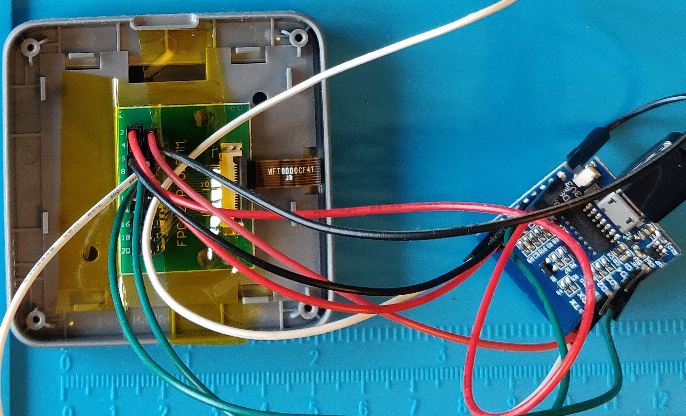
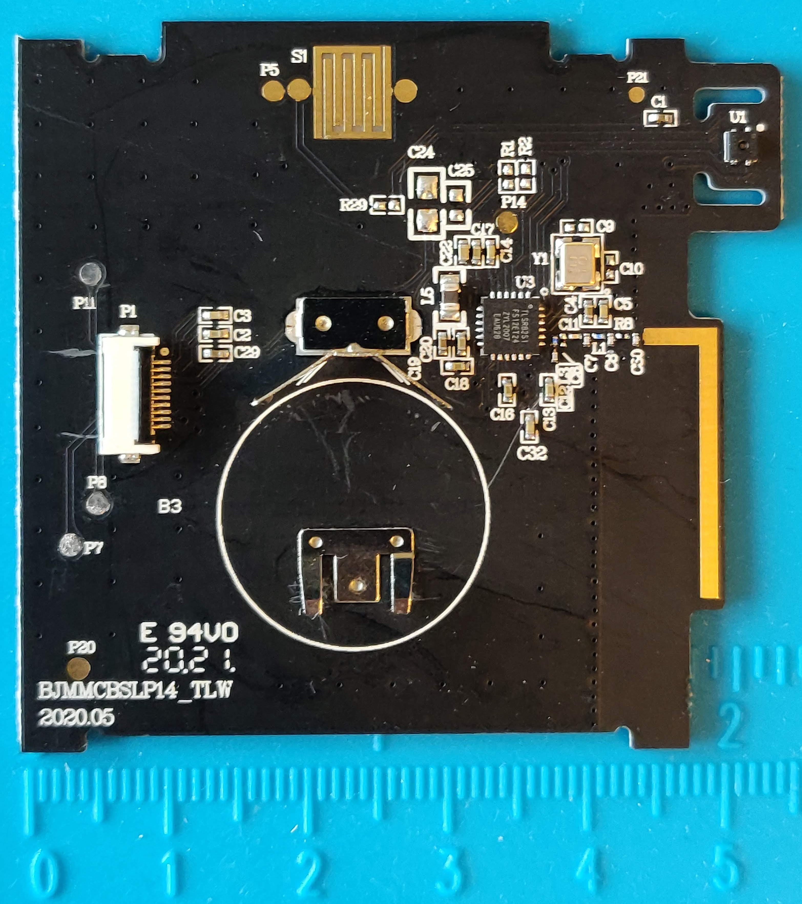
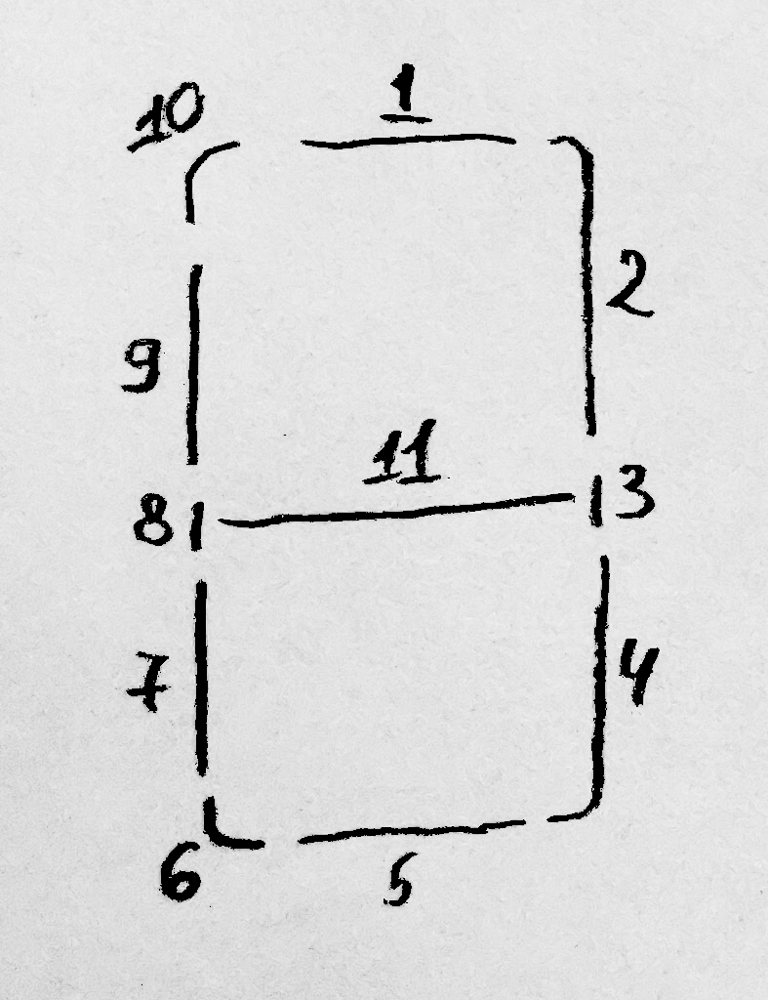

# Reverse Engineering a MHO-C401

First, I want to thank the owners of the following two GitHub repositories, whose hard work I used as foundation and inspiration when I was reverse engineering the MHO-C401 sensor:

* https://github.com/jonathonlui/MHO-C201
* https://github.com/GitJer/XiaomiMiaoMiaoCe

The current repository is a fork of https://github.com/GitJer/XiaomiMiaoMiaoCe due to my desire to use a C++ based approach, but the present README is heavily based on the reverse engineering efforts of https://github.com/jonathonlui/MHO-C201.

The **Mijia MHO-C401** (also sold as  **Xiaomi MiaoMiaoCe MMC-C401**) is a Bluetooth-enabled thermometer and hygrometer display with a segmented e-ink screen.

A multimeter in continuity mode was used to trace the connections between the stock MCU (TLSR8251) and the display controller (which is *unknown* - MHO-C201 seems to be using HT16E07, but its connections and commands differ from those used in MHO-C401).

To determine the purpose of each connection, a logic analyser was used to capture the signals (see [`./captures`](./captures)) between the MCU and display controller. The captures were compared to a number of e-ink display controllers' datasheets, but a single and exact match was not found.

The display was disconnected from the MCU board and it was instead connected to a breakout board in order to be able to control it easily with a Wemos D1 mini EPS8266-based board:

## A C++ Library

An Arduino-compatible C++ library with a few examples to control the display is in: [./XiaomiMiaoMiaoCeBT](./XiaomiMiaoMiaoCeBT).

## PCB

## Components

### **Display** at **P1**: Segmented e-paper display controller connected to PCB with 10-pin FPC.

  - Display controller IC is unknown, but unlike that used in MHO-C201, it is *not* HT1607. Some of the commands captured between the MCU and Display match HT16E07 datasheet, some match other display controllers 

### Pins (from "top")

1. VDL - Driver low supply voltage – bypass to GND with 1μF capacitor
    - Connected to capacitor at **C3**.
    - Measured voltage: 6.5V.
       
2. VDH - Driver high supply voltage – bypass to GND with 1μF capacitor
    - Connected to capacitor at **C2**.
    - Measured voltage 12.6V
       
3. GND

4. VDD - Between 2.4 to 3.6V

5. SDA (data) - connected to pin 13 (SPI_DO) of MCU 

6. SCL (clock) - connected to pin 1 (SPI_CK) of MCU

7. CSB (latch) - connected to pin 24 (SPI_CS) of MCU 
    - Low during data clock pulses, pulses high after 9 clocks pulses
  
8. UNKNOWN (probably SHD_N, connected to pin 17 (PC4) of MCU
    - Maybe this is charge pump enable pin – low shutdown
  
9. RST_N - connected to pin 3 (SWS/PA6) of MCU

10. BUSY_N - connected to pin 2 (PA5) of MCU 
    - Busy flag output pin
      - BUSY_N="0" – driver is busy, driver is refreshing the display
      - BUSY_N="1" – driver is idle, host can send command/data to driver

### **MCU** at **U3**: TLSR8251 [datasheet](http://wiki.telink-semi.cn/doc/ds/DS_TLSR8251-E_Datasheet%20for%20Telink%20BLE+IEEE802.15.4%20Multi-Standard%20Wireless%20SoC%20TLSR8251.pdf)

## Startup and Update

### On startup the stock MCU:

The MCU updates the display 3 times on startup:

1. MCU powers on
2. After 100 ms, sets Display SHD_N high
3. Send low pulse on RST_N for 110 microseconds
4. Update #1: Full black clear. This update turns on then off all black segments using special LUT values (see below for **Update Display Sequence**)
   - BUSY_N is low for about 3400 ms between after sending DRF
5. Send low pulse on RST_N for 110 microseconds
6. Update #2: Full white clear. This update turns on then off all white segments using special LUT values (see below for **Update Display Sequence**)
   - BUSY_N is low for about 1950 ms between after sending DRF
7. Send low pulse on RST_N for 110 microseconds
8. Update #3: Set all black segments on (except the background segment).
   - BUSY_N is low for about 1950 ms between after sending DRF
9. Wait 100ms
10. During this 100ms the MCU reads temp from Sensor
11. Update #4: Set some black/white segments on/off (to show temp / humidity)
   - BUSY_N is low for about 1950 after DRF
12. Sends final POWER_OFF command

### Update Display Sequence

After startup the MCU will periodically read the Sensor and sets on/off state of the segments.

1. Send low pulse on RST_N for 110 microseconds

3. Send: Power On (POWER_ON - 0x04)

4. Wait for BUSY_N high

5. Send: Panel Setting (PANEL_SETTING - 0x00)

6. Send: Power Setting (POWER_SETTING - 0x01)

7. Send: Power Off Sequence Setting (POWER_OFF_SEQUENCE_SETTING - 0x03)

8. Send: Frame Rate Control (FRAME_RATE_CONTROL - 0x30)

9. Send (ONLY when *not* initialising): PARTIAL_DISPLAY_REFRESH - 0x15

10.1. Send: LUTV (0x20), LUT_KK (0x23), LUT_KW (0x26)

  - The LUT define the timing and voltages for turning on/off the segments
  - There are 3 sets of LUT values
     1. LUT values to fully clear the display by turning on and then off all the segments
     2. LUT values to turn off segments
     3. LUT values to turn on segments

10.2. Send LUT (0x24) and LUT (0x25)

  - Send two additional LUT tables when performing update (i.e. *not* during the initialisation phase)

11. Send: Data Start Transmission 1 (DATA_START_TRANSMISSION_1 - 0x18)

  - Logic analyzer captures show DATA_START_TRANSMISSION_1 command is 18 bytes. 

11. Send: Data Start Transmission 2 (DATA_START_TRANSMISSION_2 - 0x1C)
  
  - Logic analyzer captures show DATA_START_TRANSMISSION_2 command is 18 bytes.

12. Send: Display Refresh (DISPLAY_REFRESH - 0x12)

13. BUSY_N goes low which means display is refreshing

14. Wait for BUSY_N high

15. Send: Power Off (POWER_OFF - 0x02)

## Segments

Segments are mapped accross the bits (0-7) of 18 bytes (0-17), sent with DATA_START_TRANSMISSION command. The exact mapping was determined by cycling through all the bits and bytes, using the sample here: [find_segment_positions](./XiaomiMiaoMiaoCeBT/examples/find_segment_positions).

Following image shows how the segments are mapped: first number is the byte, second number is the bit within that byte:

This convention is used in the code when defining logic groups of segments, like: `top_left`, `bottom_right`, `face` etc.

#### Segment (16,5)

Segment (16,5) turns on the parts of the display that are always on during normal usage:

- Degree symbol and common parts of C and F
- Decimal point
- Side of faces
- Percent sign

#### Segment (17,7)

Segment (17,7) is the "background"

#### Forming symbols

In order to facilitate the display of Hexadecimal numbers, another two-dimensional array is used - `digits[16][11]`. This array defines how each hexadecimal digit maps to the following group of segments (1 to 11):

You can check the following example, demonstrating how to "draw" numbers: [numbers_and_shapes](./XiaomiMiaoMiaoCeBT/examples/numbers_and_shapes).
