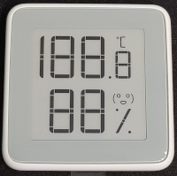
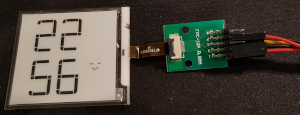

Library for controlling the e-ink display of the Xiaomi Miao Miao Ce temperature and humidity sensor.



After disassembly, the display itself looks like this (connected to a breakout board):



It is interesting to note that on the back-side of the display the segments are visible. In the segments a connection is visible, indicating that this is a segmented e-ink display. 


There is a sticker on the display that says it is a WEIFENG WUXI VISION PEAK TECHNOLOGY (WF0246S1HCF410320, U18S1219897326-G098) but I couldn't find any additional information.

The circuit board controlling the display has a [HT66F0182](https://www.holtek.com/documents/10179/116711/HT66F0182v110.pdf) MCU.

The display itself has a small driver in it (the small black rectangle near the flat-flex connection). After comparing the size of that chip and the commands that are send to it, I conclude that it is most probably the 120 Segments EPD Driver IC [HT16E07](https://www.holtek.com/documents/10179/116711/HT16E07v100.pdf).

One of the secret sauces of getting e-ink displays to work is the set of waveforms that make the colored dots go to the up or bottom side of the display. I have used a logic analyzer to find these.

Additionally I used the commands defined in the [software Holtec provides](https://www.holtek.com/documents/10179/116745/an0461.zip) for a similar device to make my own driver.

Since I wanted to make a clock with NTP time updates I used an ESP8266 (Wemos D1 mini) to control the display. The connections from the flat-flex-to-pins breakout board to the ESP8266 are as follows.

The flat flex contains 10 connections with a 0.5mm spacing. Looking from the right side towards the screen the breakout board has 10 pins with numbering:

```
1  3  5  7  9

2  4  6  8  10
```

The follwing connections (defined in XiaomiMiaoMiaoCe.h) to the ESP8266 are made:

| Breakout | ESP8266| Function  |
| -------- |:-------|:-----     |
| 1        | D2     | BUSY_N    |
| 2        | D7     | SPI ENABLE|
| 3        | D1     | SPI CLK   |
| 4        | D6     | SPI MOSI  |
| 5        | -      | not connected |
| 6        | D5     | RST_N     |
| 7        | 3V3    | VCC 3V3   |
| 8        | GND    | GND       |
| 9        | -      | not connected (VDH)|
| 10       | -      | not connected (VDL)|

Note that according to the data sheet pins 9 and 10 are VDH (12V) and VDL (3V3) that are involved in the waveforms that change the e-ink segments, need to go to ground via 1 uF capacitors. I have operated this display with and without these capacitors and it doesn't seem to make a difference.

The BUSY_N signal is generated by the display driver to indicate it is ready to receive new data. So it is an input to the ESP8266. The other signals are outputs from the ESP8266 to the display driver.

When playing with the display I noticed that if I changed the display frequently, in the examples I change the display every couple of seconds, the segments become gray. The white becomes light gray and the black becomes dark gray. Also when changing a segment to black it slowly becomes lighter gray. After leaving the display off for some time (a night) this effect disappears. In the clock example the display is changed once a minute and no graying problem is visible.
